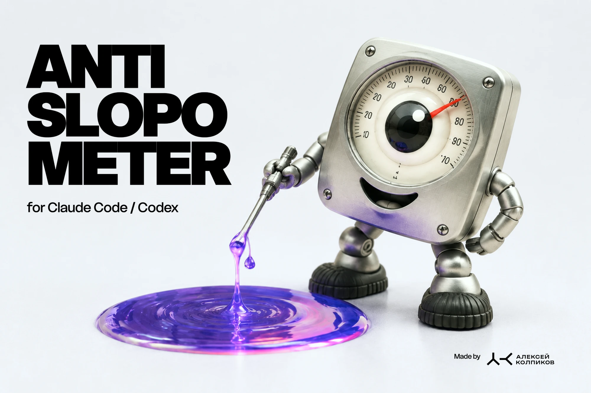

# Антислопометр



Скилл для Claude Code: измеряет, насколько сайт, лендинг или экран выглядит как то, что генератор выдаёт по умолчанию — и насколько как осознанное решение автора.

**164 критерия по 11 осям.** Шкала **0–10, где 10 — слопа нет**. Целевая планка — 8,5. Нижний якорь откалиброван на живом объекте: разобранный по кодам лендинг на 1,0 лежит в [`references/example-slop.md`](references/example-slop.md).

**Калибровка на живых объектах:** конвейер конструкторов (1С-UMI, Durable) — 3,0 · аккуратный лендинг со своей фактурой — 4–5 · работа в чужом почерке с собственными сценами — 7–7,5 · эталонный слоп — 1,0.

## Зачем

«Слоп» — это решение по умолчанию, принятое вместо решения. Он опознаётся не по вкусу, а по конкретным признакам: стеклянная плашка поверх фото, три тарифа с выделенным средним, ряд счётчиков, «Почему мы», три равные карточки на любой вопрос, градиент на фоне, кнопке и заголовке разом.

Скилл превращает это в процедуру: снять лист кадров, прочитать механику в коде, прогнать каталог, снять исключения проекта, посчитать. На выходе — короткая саммари и таблица находок с кодами, весом и заменой для каждой.

## Установка

```bash
git clone https://github.com/despoth/antislop-meter.git ~/.claude/skills/antislop
```

Дальше в Claude Code: `/antislop`, или просто «померь слоп», «проверь на слоп», «насколько это слопово» — описание скилла ловит эти формулировки.

Для других агентов скилл читается как обычный набор markdown-файлов: начните со [`SKILL.md`](SKILL.md).

## Что внутри

| Файл | Что внутри |
|---|---|
| [`SKILL.md`](SKILL.md) | процедура замера, система оценки, правила честности |
| [`references/criteria.md`](references/criteria.md) | каталог: 164 критерия по 11 осям, у каждого признак, вес и чем заменить |
| [`references/exclusions.md`](references/exclusions.md) | что не считать слопом: осознанные решения проекта |
| [`references/output.md`](references/output.md) | формат саммари и расширенной таблицы |
| [`references/example-slop.md`](references/example-slop.md) | эталон на 1,0 из 10 с разбором каждой находки |
| [`references/generators.md`](references/generators.md) | образцы по генераторам: скелеты и дефолты 1С-UMI, Tobiz, Durable, Lovable, v0, Framer и других |
| [`references/micro.md`](references/micro.md) | микроуровень ±0,1: 35 микроштрафов и 25 микробонусов |
| [`references/log.md`](references/log.md) | журнал замеров и калибровочные точки |
| [`tools/probe.py`](tools/probe.py) | быстрый разбор URL: вес страницы, заголовки, повторы кнопок, найденные коды |
| [`tools/shots.py`](tools/shots.py) | лист кадров сайта через headless Chromium (Playwright) — обязательный шаг замера |

## Оси каталога

| Ось | Что меряет |
|---|---|
| **D** | дефолт генератора: узнаваемые ходы «из коробки» |
| **K** | композиция и структура экрана |
| **M** | движение и иммерсия: пины, скрабы, удержание |
| **T** | типографика |
| **C** | цвет и поверхность |
| **F** | медиа: фото, видео и их роль |
| **X** | содержание: тексты, цифры, служебка |
| **P** | давление и тёмные паттерны: дефицит, таймеры, апсейлы |
| **U** | шаблонная подача: скелет, тройки, рубрики, штампы |
| **E** | исполнение: хардкод, мёртвый код, подключено и не используется |
| **R** | реабилитация: за что вернуть баллы, включая техническую опрятность |
| **N** | вторичность: придумано под это содержание или взято из чужого словаря |

## Как считает

Старт 10 баллов, за каждую оставшуюся находку — штраф по тяжести: тяжёлая −1,0, средняя −0,5, лёгкая −0,2.

Поверх арифметики работает потолок по плотности: три-четыре тяжёлых находки — оценка не выше 3,0, пять-семь — не выше 1,5, восемь и больше — 1,0, дно шкалы. Плюс микроуровень ±0,1 на мелочи, суммарно не больше ±0,5. Мягкие веса нужны, чтобы различать оттенки хорошей работы; странице, собранной из одних дефолтов, оттенки не нужны, там нужен диагноз.

Поверх арифметики работает **реабилитация** (ось R), максимум +3,0: своя съёмка и видео, свой набор иконок, векторные иллюстрации, предметная графика под бренд, смелая палитра, свой шрифт, нетипичная сцена, графики с настоящими значениями, проверяемая фактура, честная оговорка. Балл даётся за авторство, а не за наличие эффекта: проверка — можно ли это достать в один клик. Пока есть хоть одна тяжёлая находка, реабилитация не поднимает выше 7,0.

**Ось N обязательна.** Отсутствие дефолтов генератора — ещё не авторство: работа, целиком собранная по чужому словарю приёмов, получает N-01 (−1,5). Контрольный вопрос замера — что здесь придумано, а не выбрано из списка.

**Якоря шкалы:** 9–10 — своё решение, приём не показать в чужом портфолио · 7–8 — чужой почерк плюс одна-две свои находки · 5–6 — грамотная вёрстка по чужому словарю · 3–4 — шаблон с косметикой · 1–2 — эталон слопа. Если арифметика спорит с якорем, первым делом проверяется N-01.

**Потолок демо: 8,5.** Макет на стоке и выдуманных текстах не получает оценку уровня работающего сайта, как бы аккуратно ни был исполнен.

**Единица замера — один сайт.** Оценка ставится сайту, а не серии или стенду: приём, повторённый в пяти проектах, штрафует каждый так же, как если бы он был единственным. Средних по подборке инструмент не выдаёт.

Ключевое правило: приём, который владелец проекта сознательно выбрал, **вычёркивается до подсчёта**, а не учитывается со скидкой. Иначе оценка говорит о вкусе проверяющего, а не о работе.

## Быстрая проверка URL

```bash
python3 tools/probe.py https://example.com https://example.org
```

Печатает вес страницы, число заголовков, повторы кнопок-призывов и найденные коды. Не заменяет замер глазами: SPA отдают пустой шаблон, часть сайтов режет Cloudflare — такие смотреть браузером.

## Как расширять

1. Поймал новый тип слопа на живом объекте — сформулируй признак, по которому его узнает другой человек.
2. Заведи код в `criteria.md`: `<ось>-<номер>`, название, признак, вес, чем заменить.
3. Вкусовое решение проекта — строка в `exclusions.md`, а не код в каталоге.
4. Замер — строкой в `log.md`.

Коды не переиспользуются и не перенумеровываются: на них ссылается история замеров. Склеенные дубли остаются в каталоге пометкой на канонический код.

Правки и новые критерии принимаются через issues и pull requests — особенно с живыми примерами: ссылка на объект и формулировка признака.

## Лицензия

[CC BY 4.0](LICENSE). Используйте и меняйте свободно, указывая автора: Алексей Колпиков.
